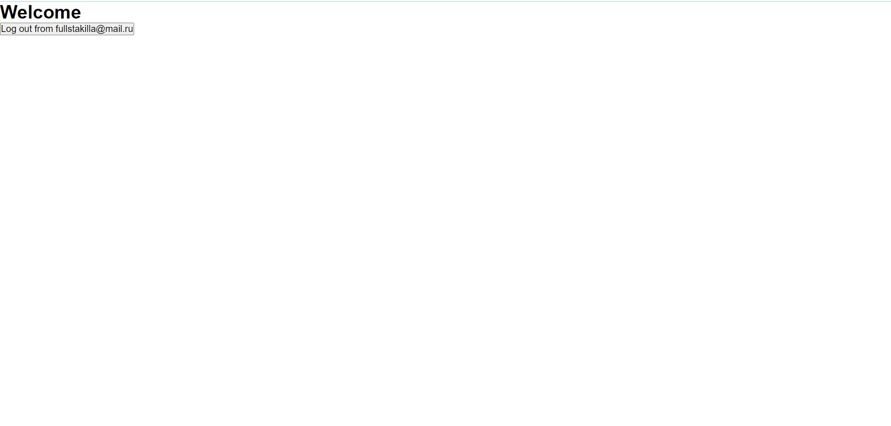

# Firebase Auth

`/register`


`/register` validated


`/login`


`/`



---

## Быстрый старт

1.  **Склонируйте репозиторий.**

    ```sh
    git clone https://github.com/fullstakilla/React-firebase-authorization
    ```

2.  **Начните просмотр.**

    Перейдите в директорию `client` и запустите проект на стороне frontend.

    ```sh
    yarn install
    yarn dev
    ```
